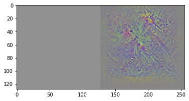

# Dreaming of Birds: Exploring Deep Dream Generative Phenomena in Computer Vision

## Michael Shuen

**Link to Slide Deck:** [https://docs.google.com/presentation/d/e/2PACX-1vTfND-ol1-7Wh64Dvsin7vl2rxdnrr7XVyOfFmUAwJftXnefpcfqaHMztYjyWbSl-eA6eNK3ZyhvnLh/pub?start=false&loop=false&delayms=10000](https://docs.google.com/presentation/d/e/2PACX-1vTfND-ol1-7Wh64Dvsin7vl2rxdnrr7XVyOfFmUAwJftXnefpcfqaHMztYjyWbSl-eA6eNK3ZyhvnLh/pub?start=false&loop=false&delayms=10000)

**Link to video:**

## Abstract

In this project, I sought out to explore how the "deep dream phenomena" arose and its properties. In particular, I wanted to find out how to generate interesting dream images and how they would be affected by changes in the underlying model. I trained a model based on the bird classifier from CSE455 and used it to generate deep dream images under various parameters. The work shows that this model is capable of producing convincing images that bear resemblance to the training set. I determined how training time and dream time relate to different aspects of the visual output. I then explored whether freezing the model (except the fully connected layer) would create the same kind of imagery from the pre-trained features.

## Problem Statement

For this project, I posed the question of how deep dream behavior could be created and how this behavior and the specific visuals generated would change with things like the progression of model training and training parameters. I also wanted to explore the visuals that could be generated through this process.

## Related Work

The training data that I used was the Bird Project classifer data from the computer vision class, first resized to 128x128. I used the same model as I did then, a pre-trained Inception_v4 network from the `timm` library.

Some inspiration for scoring the model was taken from a TensorFlow blog post on deep dreams: [https://www.tensorflow.org/tutorials/generative/deepdream](https://www.tensorflow.org/tutorials/generative/deepdream)

## Methodology

The "forward" training of the model on the bird dataset was unremarkable: a standard training methodology was used.

To generate the "dream" images, I started from a set of input images, only one of which was used for the outputs shown (more on that later). I used a `DataLoader` to supply these images to the dreaming process. For each iteration, the image was passed through the network and a prediction was made as to which class it belonged to. Then, the network was informed of the "correct" class (the class we wished to emulate), and a gradient was calculated. The model was frozen, so no updates were made to its layers. Instead, the gradient was propagated backwards all the way to the input image, where updates were made. Then, some intermediate processing was done on this generated image, which included clamping the pixel values and performing a small Gaussian blur, as well as a random horizontal flip. This process was then repeated many times.

The loss function that I used for this dreaming process was something that I worked on over the course of this project. Initially, I used the `CrossEntropyLoss` of the predicted and "correct" labels, but I later switched to directly taking the values of the neurons in the final connected layer, which will be discussed below.

The input image that I used for the results discussed here was an 128x128 image of RGB values `(128,128,128)`. I also attempted to use a color gradient image, but no visible changes were ever made to this image. This was because the magnitude of the changes was incredibly small, and the naive range expansion method I used to make the output visible could not handle this.

## Experiments and Results

I explored how the model performed with and without various levels of training on the bird dataset. The number of neurons in the final layer was different (555 vs. 1000) compared to ImageNet, so the model initally had random weights in this final layer. As expected, the images generated did not resemble the training set:

### Aside on the output format

Due to some issues with the training process, the methodology that eventually worked out results in very tiny changes to the image. The "raw" output from the network is shown on the left side, and the right side shows the output "rescaled" to the 0-255 range.

### Initial challenges

Initially, I faced some challenges with getting this process to work at all. Even after one training epoch, the values of the output images would spiral off towards infinity. I tried some suggestions, like clamping the image to the [0,1] range after every pass, and a small amount of Gaussian blur. However, the actual problem was that the inital learning rate (`lr=0.01`) copied over from model training was too high. After reducing the learning rate several orders of mangnitude, experimentation could really begin. I first trained the Inception_v4 model for 10 epochs on the 128x128 bird dataset, then ran 200 epochs of the dream process.

However, the output produced by this process was relatively unsatisfying.

### New Loss Function

I theorized at this stage that my choice of loss function might be playing a role. The `CrossEntropyLoss` formulation caused the network to try and make the generated image more like a target class, *but also less like all other classes!* This was not what I wanted; the optimal incentive would be to only care about the single class of interest and to not even consider the other classes. Therefore, I changed the loss function to just be the negative of the activation of the neuron in the final layer corresponding to the desired class. This way, gradient descent would actually seek to increase that neuron's activation. Initally, this resulted in a different "feel" to the outputs, but no birds yet:

After increasing the learning rate significantly, though, there were promising signs:

After this initial success, I attempted to strengthen the images and make them more interesting. 

One approach that didn't seem to provide a benefit was varying the strength of the guassian blur after each pass. I tried varying the sigma in the ranges `(0.1, 1.0)` and `(0.1, 0.5)` (compared to a fixed sigma of 0.5 previously), and the image quality appeared to degrade slightly:

On the other hand, increasing the number of passes through the dreaming process significantly improved image quality, up to 500 epochs.

At 1000 epochs, the images got more abstract, as if the network was devoting less effort to the birds and more effort to other patterns it deemed interesting.

### (Intentionally) Overfitting the Model

Since it seemed there would be diminishing returns from just allowing the dream process to continue further, I began exploring what would happen if I trained the model on the bird training data more. From rereading my previous notes on the bird project, I determined that training for 20 epochs at `lr=0.01` should overfit the model. I wanted to explore how the dream output would be affected as a result. I ran the dreaming process for 500, 1000, and 2000 steps.

500 steps:

1000 steps:

2000 steps:

### What It Takes To Dream: Not Just The Linear Layer

I also wanted to explore whether model "finetuning" was necessary in order for dreaming to be possible. In transfer learning, a model (Inception_v4 in our case) is trained on some dataset (ImageNet), and then that pre-trained model is then trained further on data specific to a new application or task. During this second training phase, some of weights can be frozen for performance reasons. If this is the case, the non-frozen layers are the only part of the model that can adapt to the new task. I explored whether such a model can also be used to generate deep dream images.

I found that the answer is no. At least for the Inception_v4 network for this specific bird classification problem, training only the fully connected layer is insufficient for bird-like output to appear via the deep dream process.

Trained for 10 epochs, 500 dream steps:

Trained for 20 epochs, 1000 dream steps:

## Further Work

Due to time and scope constraints, not everything that could have been performed was covered. Some avenues for future exploration include:

* Exploring the dream phenomena created from non-uniform initial images, such as gradients or highly blurred images
* Creating a visualizer for combinations of number of training epochs and number of dream steps
* Using a "better" or "worse" model architecture
* Selecting intermediate neurons or layers for activation rather than the fully connected layer
